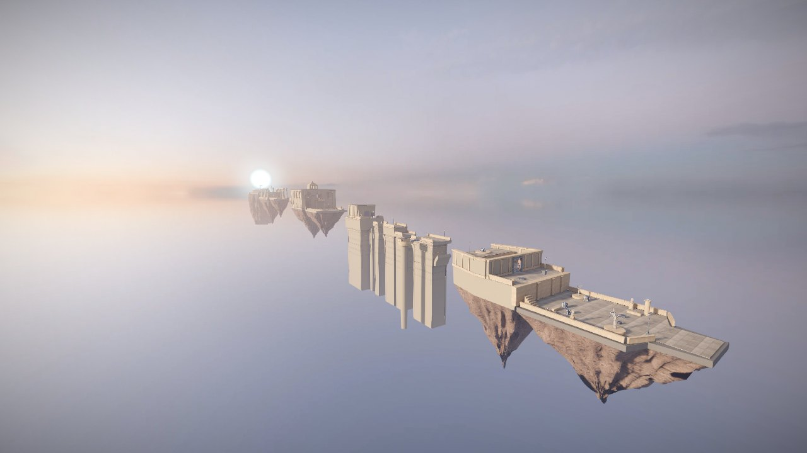
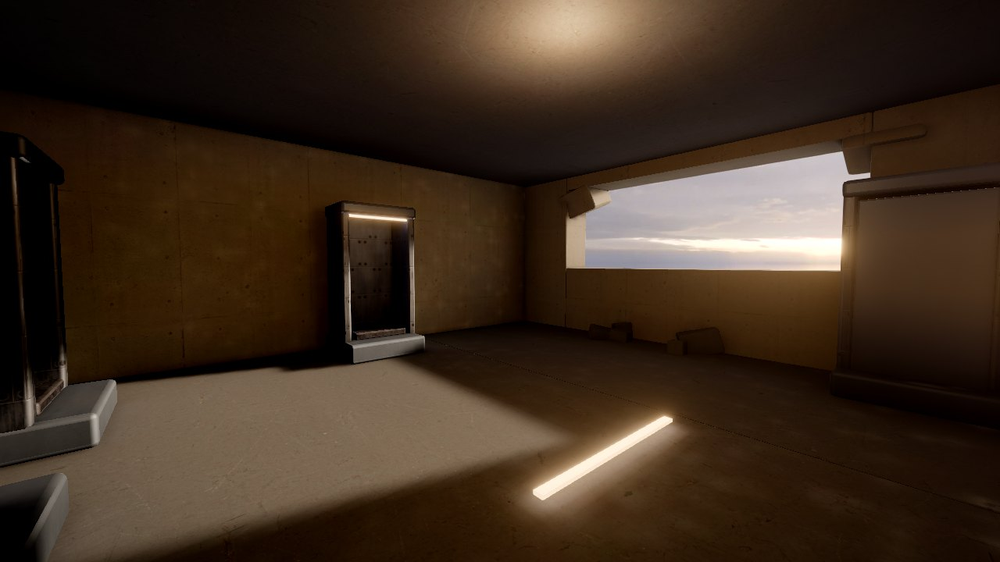
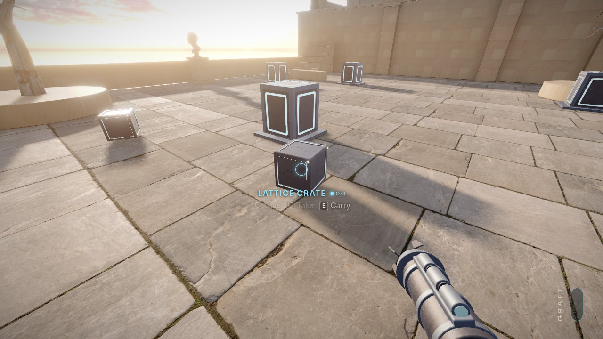
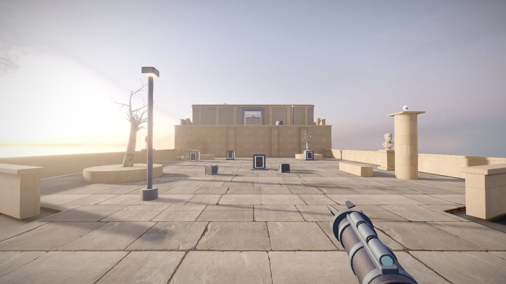
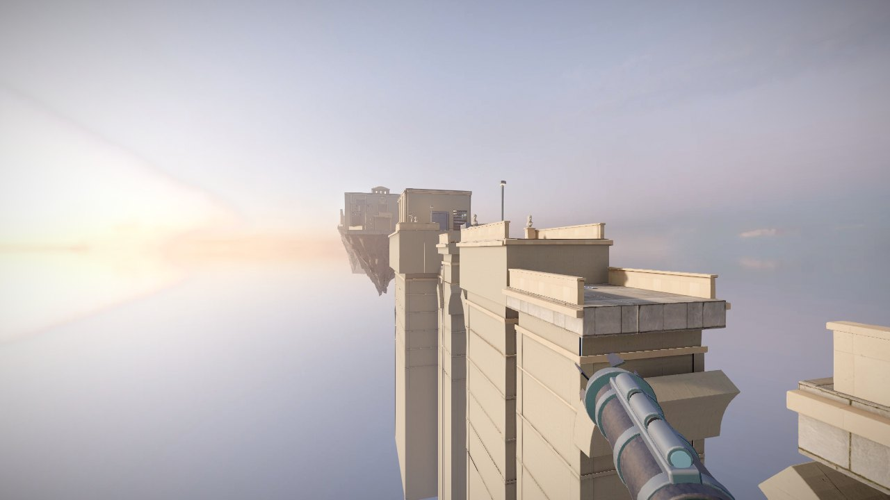
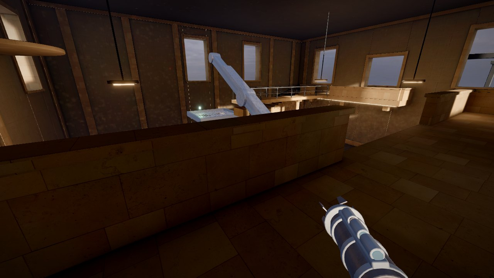
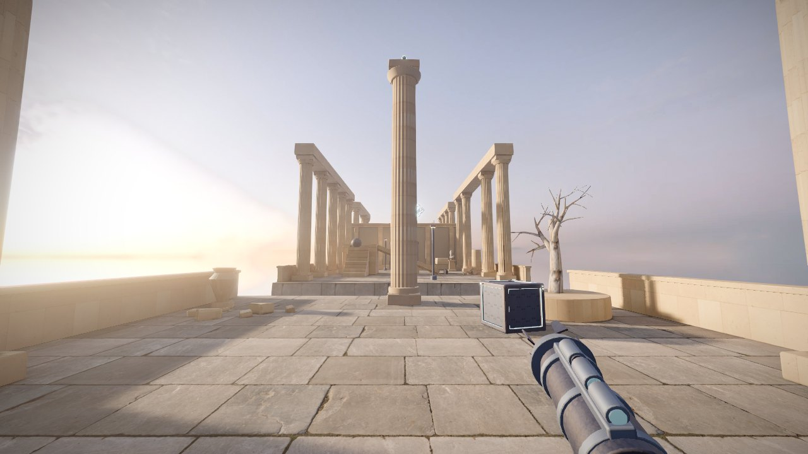
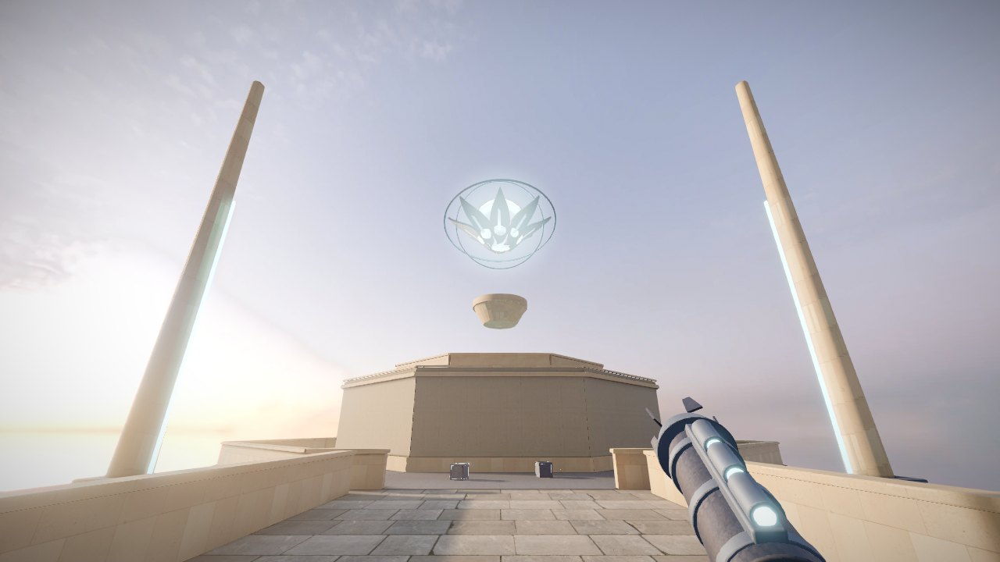

# Bloomfall: Lore

A guide to Calyx, the city where Bloomfall takes place. Everything here comes from the game: the Gardener's voice, the cards, the memories left behind, and the places themselves. It stays clear of the puzzle solutions and the ending. Those are in [SPOILERS.md](SPOILERS.md).

## The dark sky

Bloomfall is set so far in the future that the sky has gone dark. Space itself kept stretching, faster and faster, until every other galaxy was carried past the edge of what can be seen. No new light arrives. The night sky over Calyx is empty.

The people of Calyx did not wait for the dark to close in. They learned to make their own room.

> The sky went dark long ago. Every other star fell past the edge of the sky. So we made our own room. We bloomed new space from nothing, for ten thousand years.
>
> The Gardener

## Calyx

Calyx is the last city. It was built in the style of a planet none of its people had ever seen: marble colonnades, stone terraces, arcades, busts of founders, urns on the balustrades. Under the marble is newer work. Steel frames, glowing seams, and lattice hold it together.

For ten thousand years the city grew by blooming. When Calyx needed a new district, its engineers bloomed the space for it out of nothing, and the district was built into the new room.

Calyx no longer turns. Its old sun hangs at the horizon, and the evening does not end. There are no seasons left.

> The Colonnade fell last spring. There is no spring anymore. There is only this evening, and it does not end.
>
> The Gardener

## The Heartbloom

The Heartbloom is the engine at the center of the city that makes the space. It is a seed of light the size of a house, floating over a well, wrapped in turning rings and a flower of lattice petals. Its cold light can be seen from every district.

The Heartbloom would not stop. Space pours into Calyx faster than anyone can use it. Every street is wider than it was yesterday. Bridges stretch until they tear. The districts have come apart into islands, drifting away from each other in a golden haze. Whole terraces break off and fall into it.

> Every street is wider than it was yesterday. Every friend is farther away.
>
> The Gardener

## The Gardener and the Tenders

The Gardener was the last keeper of Calyx. The Tenders were the Gardener's work: small gardeners built to look after the city, to prune what grew wrong and move what needed moving.

The Gardener left one Tender asleep in a pod in the Seed Vault, with a recorded voice to wake it and a Graft by the dead tree in the cloister. You are that Tender. The voice you hear is the recording.

> Tender. Wake up. If you can hear this, the Heartbloom did not stop.
>
> The Gardener

## Lattice and the Graft

Lattice is the material Calyx was bloomed into. It is dark metal with glowing seams, and it can hold space in its folds. Give a lattice crate more space and it grows. Take the space out and it shrinks. Lattice pushes as it grows, and it lifts whatever stands on it.

The Graft is a Tender's tool, worn on the forearm. It holds space in cells. It can take space out of lattice and give it back somewhere else, even from far away, and even through a perforated screen. Crates, orbs, bridge spans, pillars, and rams in Calyx are all lattice.

The Graft obeys one law. It cannot make space and it cannot destroy it. Everything it takes, it has to give back somewhere else.

> It cannot make space. It cannot destroy it. That was the law. We broke it.
>
> The Gardener

## Weights and measures

In Calyx, room was counted in cells, and weight follows size. A small crate weighs 1. A medium crate holds four times the space and weighs 4. A large crate weighs 16. A Tender weighs 4.

The city's plates and gates were built to that measure. A pressure plate shows how much weight it needs with a ring of notches around its rim.

## Places

### The Seed Vault

A concrete bunker at the south tip of an island, where the Gardener kept Tenders asleep in pods. Beyond it is a cloister of marble arcades around a dead tree, a garden walk, and a terrace at the island's northern tip. The vault's corridor has fallen in, and one of the arcade's columns lies across the floor.

### The Terraces

A district of stepped gardens and retaining walls. The gardens have gone to dry leaves and dead trees. Lattice bollards stand in steel sockets along the walls.

### The Viaduct

Calyx tried to hold its districts together with bridges. The Viaduct is what is left of one: tall stone piers standing in the haze, with lattice spans that fold and unfold between them. A shrine sits at its northern end.

> We tried to hold the districts together with bridges. The space between them grew faster than we could build.
>
> The Gardener

### The Weighhouse

The hall where Calyx measured out space, room by room and household by household. Its great scale still hangs from the roof, and a counterweight lift climbs to the balcony. A lantern crowns the roof and an emblem of the scale hangs over the door.

> The Weighhouse. Here we measured out space, room by room, life by life. There was never enough. So we made more.
>
> The Gardener

### The Colonnade

A concert ground ringed by fluted columns, with a dry fountain at its center and a plinth at the far end. Some of its columns still stand. Some only stand until something pushes them.

### The Heartbloom

A promenade lined with glowing spires leads to a ring around a bright well. The Heart floats over the well, above a platform on a column of light, inside a wall shaped like the sepals of a flower.

## Memories

The people of Calyx left memories: small green seeds that hold a few written lines. Six of them lie along the Tender's way. Each one records a moment from the years when the city came apart: a letter, the minutes of a council vote, an engineer's note. They are optional. The pause menu counts how many you have kept.
