# The Tithe: Lore

A guide to Halcyon, the city where The Tithe takes place. Everything here comes from the game: its opening, its inscriptions, and what it tells you about its people. It stays clear of the boss fights, the late game, and the ending. Those are in [SPOILERS.md](SPOILERS.md).

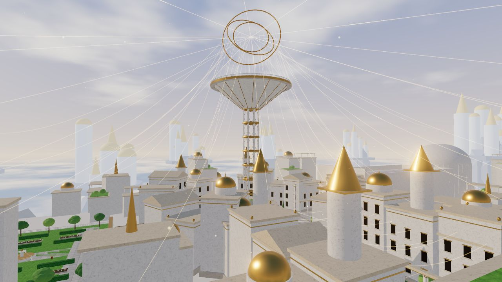

## Halcyon

Halcyon is a city built on a mountain above a sea of clouds. Its streets are white marble. Its domes are gold. Its fountains never stop. There is no hunger in Halcyon, no sickness, and no grief. The city has not wept in thirty years.

At the center stands the Spire, a lattice tower that rises out of the Plaza of Accord. At its top is the Loom, three golden rings that turn slowly over the city. Every thread in Halcyon runs through them.

## The Concord

Aurel, the Architect, found that pain could be moved. He bound every citizen to every other with golden threads and called the web the Concord. Joy runs along the threads, and everyone shares it.

Pain runs along them too, and Aurel would not let it be shared. Every hurt in the city runs down the threads into one person, chained in a well beneath the streets. The city named that person the Tithe.

The threads are visible if you know how to look. They hang between rooftops, sag between citizens standing side by side, and run from far towers on the horizon up to the Loom.

> THE CONCORD. *What one bears, all bear. What all would bear, one bears for us.*
>
> Inscription in the Plaza of Accord

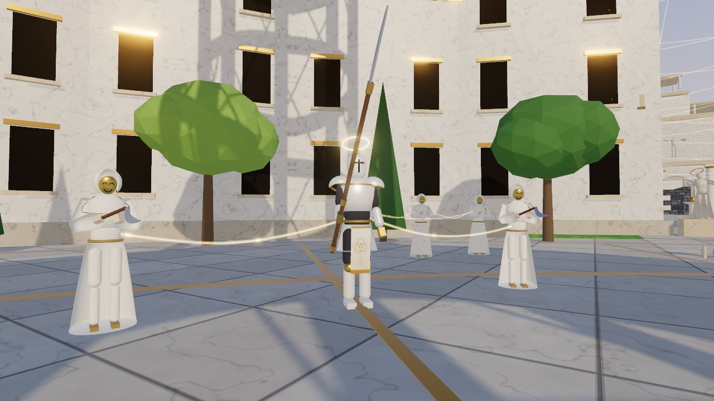

What the Concord joins, the Concord binds. When a thread's end dies, its pain has to go somewhere. It runs back down every thread tied to the dead, and whatever waits at the other end feels it all at once. The people of Halcyon have never felt pain. When it arrives down a thread, it staggers them. It can kill them, and then their own threads carry it on.

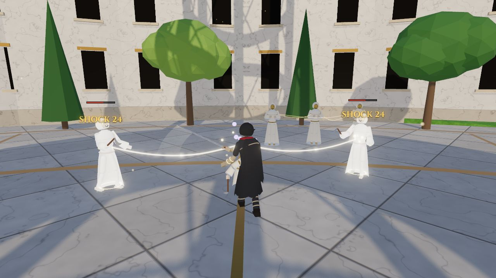

## The Tithe

You were chosen at seven. For thirty years the city's pain has run down the threads and into you, in the Well beneath the south of the city. You were meant to die there. The Tithes before you did.

> TITHE THE NINTH. *Chosen at six. She carried Halcyon for forty-one years. Halcyon is grateful.*
>
> TITHE THE ELEVENTH. *He carried Halcyon for nine years, then broke. A new Tithe was chosen within the day.*
>
> TITHE THE TWELFTH. *The name has been scratched out. Chosen at seven. Carrying.*
>
> Plaques in the Gallery of the Tithes

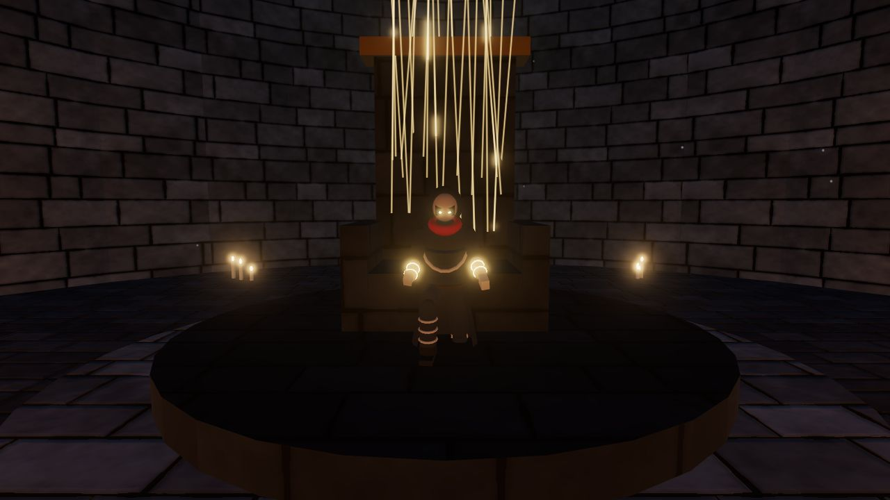

Tonight the threads frayed. You tore free of the seat, and on the altar in front of it you found the Needle. It is a long, thin blade with an eye near the hilt and a red thread wound around the grip. They used it to sew you into the seat. Now it cuts.

The Concord will not let its Tithe die. When you fall, the threads drag you back to the last Vigil where you rested.

Thirty years of the city's pain are still inside you. The game calls it Grief. When you are hurt, it grows. When you hurt them, it grows. Spend it, and you can tie threads of your own. Yours are red.

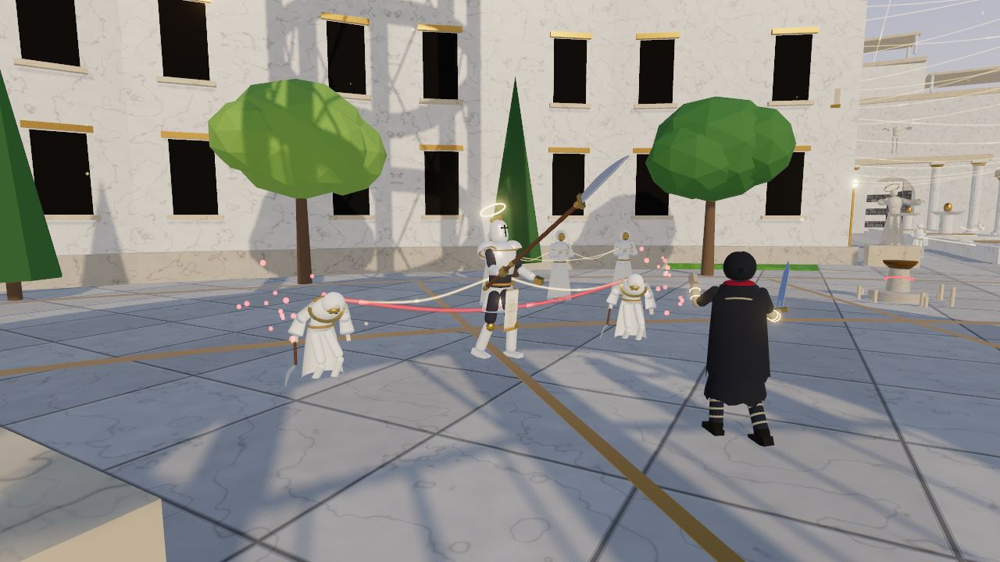

## Places

### The Well and the Undercroft

The Undercroft is a string of stone rooms beneath the south of the city, lit by candles left for nobody in particular. The Well is at the bottom. Its ceiling opens into a shaft, and the golden threads of the whole city come down that shaft into the seat.

Past the Well is the Gallery of the Tithes, where the Tithes before you kneel in stone. A long stair climbs from the last room up to the Gate of Descent.

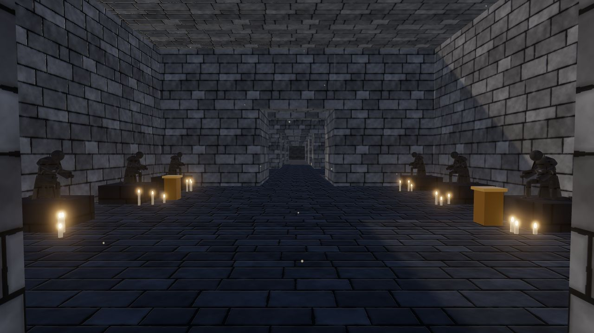

### The Promenade

The Gate of Descent opens onto the Promenade, a long white avenue of colonnades, lawns, and reflecting pools that runs north to the Plaza. Statues of Aurel stand at its end with their arms open.

> AUREL, WHO TOOK OUR PAIN AWAY. *No child of Halcyon shall ever know grief.*
>
> Inscription at the north end of the Promenade

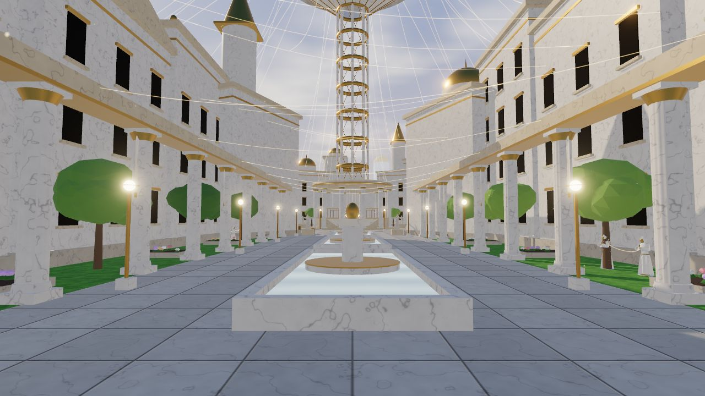

### The Plaza of Accord

The Plaza is a great ring of tiles inlaid with gold, circled by buildings and statues of the Virtues. The Contented stand in small groups at its edge, facing the Spire. At the foot of the Spire is a rotunda of columns. A curtain of threads closes it, held by two golden knots.

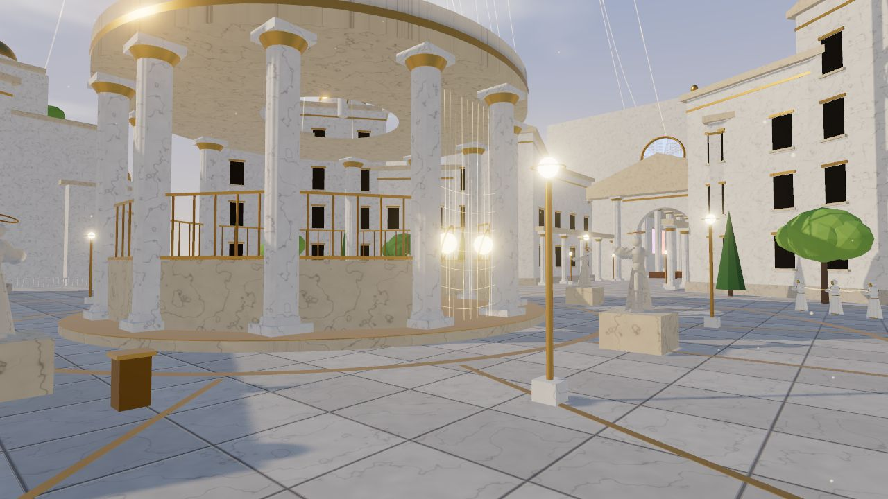

### The Gardens of Plenty

West of the Plaza, the Gardens step up the mountain in three terraces of lawns, hedges, flower beds, and fruit trees. Some of the trees are gold. Castellan Voss keeps the top terrace.

> THE BALLOT OF THE TWELFTH TITHE. *For: 40,211. Against: 3. The Concord thanks every citizen for their unity.*
>
> Inscription beside the fountain on the lowest terrace

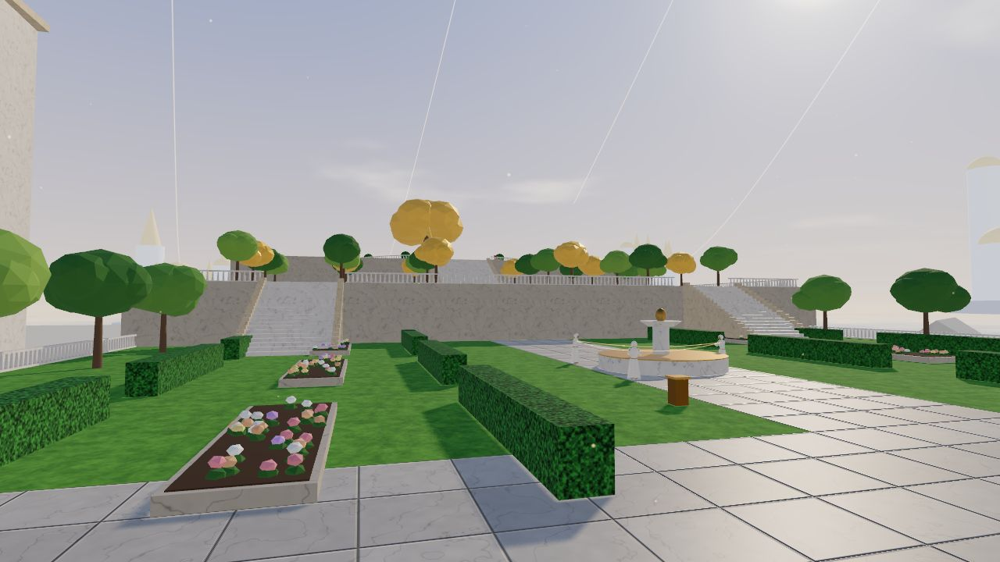

### The Choir of Accord

East of the Plaza is the Choir, a cathedral with a ribbed vault and stained glass. Its congregation stands in the pews with arms raised and does not leave. A side chapel off the north aisle holds an old hymn. Past the altar, Mother Seraphine waits.

> THE HYMN OF ACCORD. *One thread, one voice, one heart. And the Well beneath us sings, so that we need not.*
>
> Inscription in the side chapel

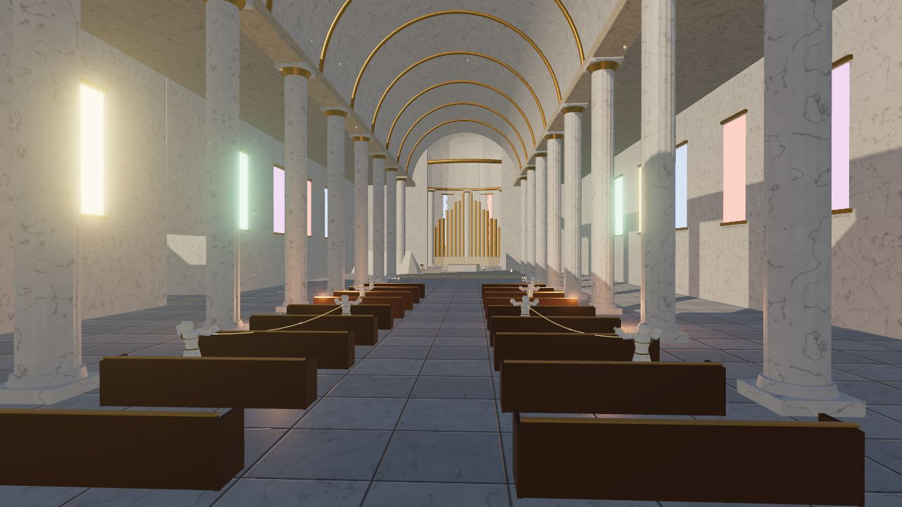

## The People of Halcyon

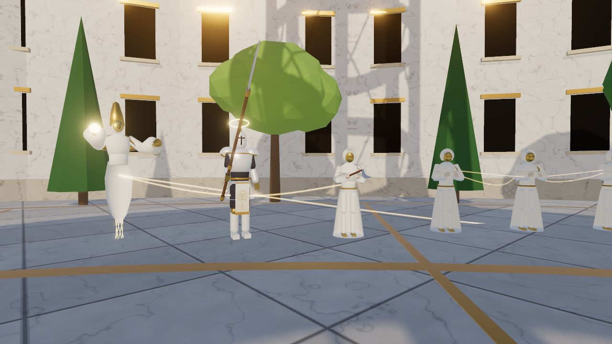

**The Contented.** Most of Halcyon's citizens stand where they have always stood, in white robes behind smiling golden masks. They do not move. Threads join them to each other. They are content.

**The Serene.** Citizens who move. Gardeners with pruning sickles, masked like the rest. Alone they are weak. Tied together they are dangerous.

**Wardens.** Halcyon's peacekeepers wear white enamel plate and carry glaives, with a small golden halo above each helm. They swing slowly and hard.

**Cantors.** Floating singers in tall gold headdresses. Their robes thin into threads where their legs should be. They throw light from a distance, and when anything tied to them is hurt, they sing it whole.

## The Three

Three chose you. You remember every one. The pause menu keeps their names.

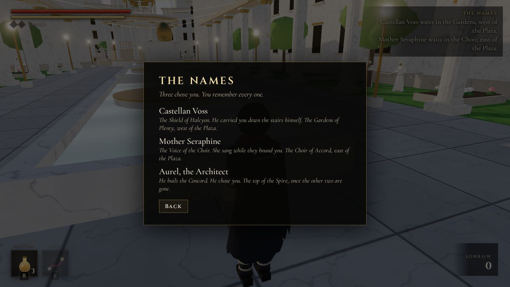

**Castellan Voss, the Shield of Halcyon.** He carried you down the stairs himself. He waits in the Gardens of Plenty, west of the Plaza.

**Mother Seraphine, the Voice of the Choir.** She sang while they bound you. She waits in the Choir of Accord, east of the Plaza.

**Aurel, the Architect.** He built the Concord. He chose you. He waits at the top of the Spire.

## Things You Carry

- **The Needle.** Your weapon, taken from the altar in the Well.
- **Nectar.** The ambrosia of Halcyon, in small gold vials. You stole three.
- **Sorrow.** What the dead leave behind. The Vigils accept it and make you stronger.
- **Grief.** Thirty years of the city's pain, still inside you. It fills the red diamonds under your stamina, and Bind spends it.
- **Vigils.** Memorial candles nobody in Halcyon lights anymore, with a red thread knotted around each stone. Rest at one and your wounds close and your Nectar refills. Everything you killed stands up again. You can travel between the Vigils you have lit.
- **Heartstrings.** Thick white threads that run from each of the three up to the Loom. You can see them from anywhere in the city. Follow one and it leads you to a Name.
