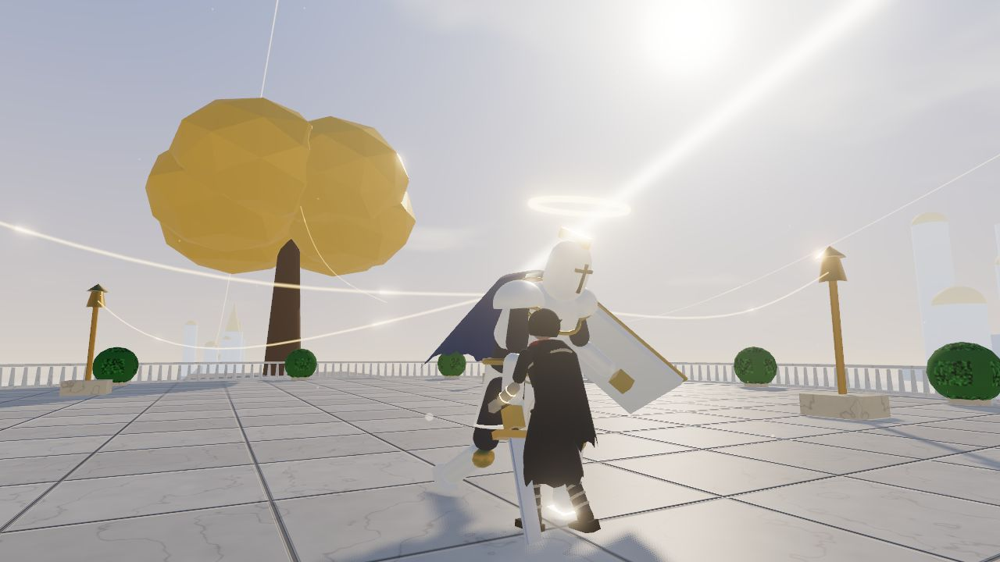
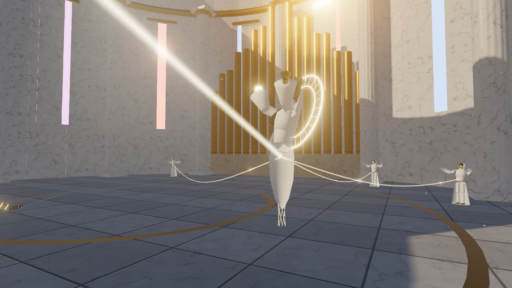
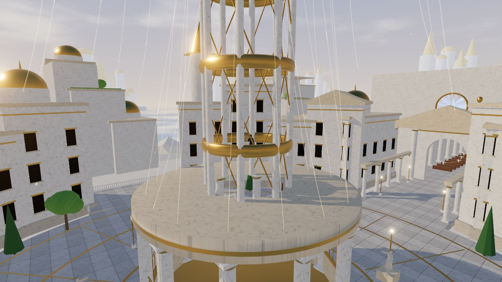
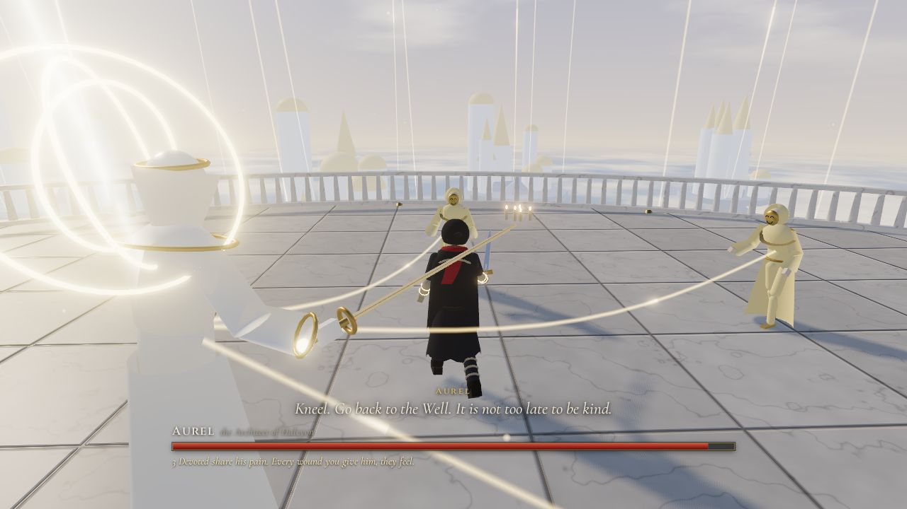
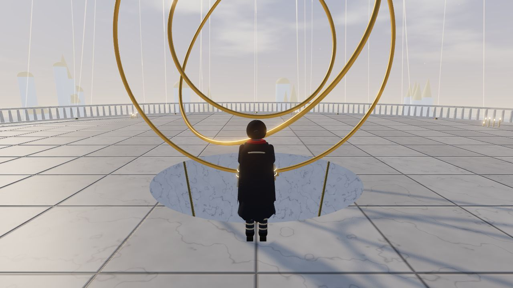
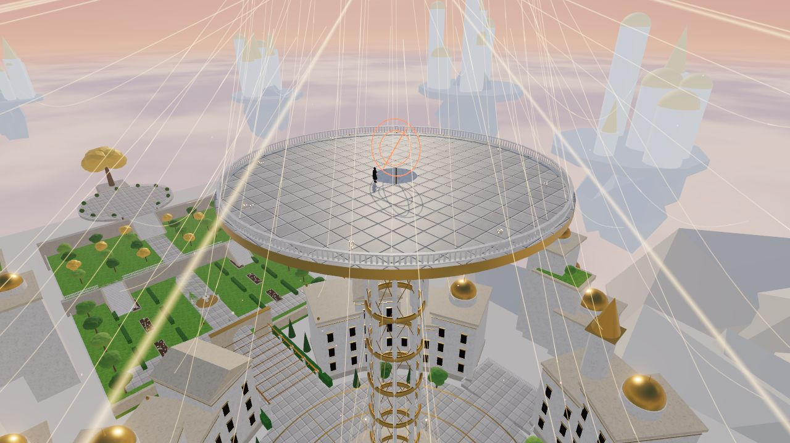

# The Tithe: Spoilers

This file gives away the boss fights, where things are hidden, the late game, and both endings. If you have not finished the game, read [LORE.md](LORE.md) instead.

## Hidden things

- **Nectar Vials.** Two lie off the main path. One is at the north end of the middle terrace in the Gardens. The other is in the Choir's side chapel, off the north aisle. Each one adds a Nectar to what you carry, up to five.
- **The eight Vigils.** In the Undercroft, at the Gate of Descent, in the Plaza, at the foot of the Gardens, outside Castellan's court, inside the Choir's doors, beside the Choir's altar, and inside the Spire. The one outside Castellan's court and the one beside the altar exist so a boss attempt never starts with a long walk.

## Learning Bind

The Undercroft does not teach Bind. When the first of the three dies, whichever one you kill first, their pain comes back down the Heartstring and into you. A few seconds later a card explains Bind, both diamonds of Grief fill, and the Bind slot appears on the HUD.

## Castellan Voss, Shield of Halcyon

He is a giant in white plate with a tower shield and a greatsword. He waits in a round court at the top of the Gardens, beside a golden Tree of Plenty. An inscription at the top of the grand stair warns you before you go in.

> CASTELLAN VOSS, SHIELD OF HALCYON. *My oath is my strength, and the city shares my wounds.*
>
> Inscription at the top of the grand stair

"The Tithe, walking? Then I failed my oath once. I will not fail it twice."

Four Oath-Lanterns burn around his court, each tied to him by a thread. While any of them burns, he takes half your damage. Each lantern you break sends its pain down the thread, and he staggers. He cleaves, slams, bashes with the shield, leaps, and charges.

When the last lantern breaks, he roars: "No oaths left. Only me." From then on he feels every hit, and he adds a spinning sweep.

When he dies: "I kept... the peace..."

## Mother Seraphine, Voice of the Choir

She floats in white and gold with a halo of threads behind her and a bell in each hand. She waits in the apse past the altar, under a dome open to the sky.

"Little Tithe. You used to sing with us, before. Do you remember the words?"

Her Choristers stand around the apse and do not fight. They sing, and the song runs down their threads and closes her wounds. Each Chorister you silence shocks her. More of them arrive while the fight goes on. She throws fans of light, rings the floor with a wave you have to roll through, cuts with her bells, and vanishes to reappear across the apse.

At half health: "Then I will sing louder." She calls another Chorister and starts to sing pillars of light down on you. "Sing with me."

When she dies: "It hurts. Is this... what you... every day..."

## The Spire

Each of the three is tied to the Loom by a Heartstring. When one of them dies, the pain climbs the Heartstring to the Loom, and a seal on the Spire breaks. Castellan and Seraphine each hold one of the two seals on the rotunda. Kill both and the curtain of threads opens.

Inside the rotunda are a Vigil, a lift, and one more inscription.

> THE ARCHITECT'S LAW. *Pain divided among all is still pain. Pain given to one is peace.*
>
> Inscription inside the rotunda

The lift rises seventy meters to a round platform open to the sky. The three rings of the Loom turn above it.

## Aurel, the Architect

He wears a long white coat and a porcelain face with closed eyes, and three thin golden rings turn behind his head. His weapon is a golden baton that is also a blade.

"Thirty years. Do you know what your pain bought? Every child in Halcyon grew up laughing."

"Kneel. Go back to the Well. It is not too late to be kind."

He strikes in combinations, lashes a line of light along the floor, and throws needles of light. About fifteen seconds in, he calls his Devoted: "Come, my Devoted. Share my pain, as you always have." Three of them come to him. While any of them lives, he takes half your damage, and every wound you give him hurts them too. Once they are all dead, he calls three more after a while.

Below 55 percent health he tries to make you the Tithe again: "Then carry it. As you always have." The Loom turns red. He throws a thread that ties itself to you and drinks your health. Bind, with a full Grief pip, sends it back: "Thirty years of it. All of it. Back up the thread." He also brings columns of light down from the Loom.

When he dies: "Everything... is connected. Whatever you choose now... they will all feel it."

## The Loom

When Aurel dies, the Loom comes down to the platform. It shrinks as it falls, until its rings turn within reach.

> *Every thread in Halcyon runs through your hands now. Thirty years of their pain is still in you.*

You can do one of two things.

**Sever the Concord.** Cut every thread. Halcyon will feel its own pain from now on. Nobody will carry it for them again.

> You cut the Concord, thread by thread.
> That night, for the first time in thirty years, Halcyon felt its own pain.
> Some of them wept. A few of them wept for you.
> Nobody was chosen the next morning, or the morning after.
> You walked out through the open gate, and you did not look back.

**Return the Tithe.** Send thirty years of pain back up the threads. All of it, to all of them, at once.

> You sent it back. Thirty years of it, all at once.
> Halcyon did not scream. It had never learned how.
> By morning the fountains still ran, and nobody was left to hear them.
> The Spire stands over a silent city.
> You carry nothing now. Not even them.

Either way, the game ends there and clears its save.
